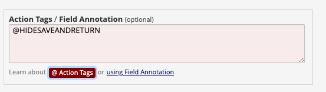

# OVERVIEW - MGB HIDESAVEANDRETURNAction Tag

## Summary
This module adds the @HIDESAVEANDRETURN as an action tag that can be added to any field. If the field is on a survey  it inserts javascript that hides the "Save & return" button.

## Overview
There  are specific use cases  where the "Save & Return" button need to be hidden from particular surveys within a project.

 ## Example
Add @HIDESAVEANDRETURN to the "Action Tags / Field Annotation" field.

## Other info
This differs from the HideSaveReturnBtn external module in that HideSaveReturnBtn disables the button for all pages in all  surveys of a project. Instead, this jus adds an action tag  that can be used on specific pages of particular surveys.